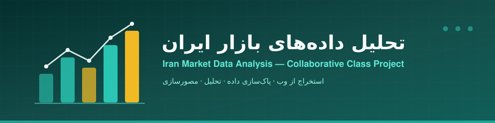
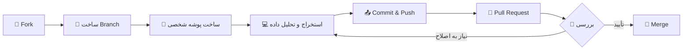

<div align="center">



# 📊 تحلیل داده‌های بازار ایران

**پروژه مشارکتی کلاس تحلیل داده — از وب‌اسکرپینگ تا مصورسازی**

[](https://www.python.org/)
[](https://pandas.pydata.org/)
[](https://www.crummy.com/software/BeautifulSoup/)
[](https://matplotlib.org/)
[](https://jupyter.org/)
[](./CONTRIBUTING.md)

[معرفی](#-معرفی) · [چرخه مشارکت](#-چرخه-مشارکت) · [ساختار](#️-ساختار-مخزن) · [شروع سریع](#-شروع-سریع) · [پروژه‌ها](#-پروژههای-دانشجویان) · [قوانین](#️-قوانین-مشارکت)

</div>

---

## 👋 معرفی

این مخزن، مرکز مشترک پروژه‌های تحلیل داده دانشجویان است. هر دانشجو یک **سناریوی واقعی** از بازار ایران — مثل قیمت خودرو، موبایل، لپ‌تاپ یا اجاره مسکن — را انتخاب کرده، داده‌های آن را از **دیوار** استخراج می‌کند، سپس پاک‌سازی، تحلیل و مصورسازی می‌کند و نتیجه را در قالب یک **Pull Request** به این مخزن ارسال می‌کند.

هدف این پروژه، تمرین چرخه‌ی کامل یک کار تحلیل داده است: از گرفتن داده‌ی خام و نامنظم، تا رسیدن به یک نتیجه‌ی قابل‌دفاع و گزارش‌دهی آن با نمودار. در این مسیر با ابزارهای واقعی صنعت — Python، Pandas، Beautiful Soup و Jupyter — کار می‌کنیم و در عین حال با گردش‌کار حرفه‌ای گیت (Fork / Branch / Pull Request) آشنا می‌شویم؛ همان چیزی که در پروژه‌های تیمی دنیای واقعی به آن نیاز دارید.

---

## 🔄 چرخه مشارکت



---

## 🗺️ ساختار مخزن

```text
iran-market-analysis/
├── README.md               ← همین فایل
├── CONTRIBUTING.md         ← راهنمای کامل fork / branch / PR
├── assets/
│   └── banner.svg          ← بنر پروژه
├── projects/
│   ├── _example/           ← نمونه ساختار (اینجا را ببینید!)
│   │   ├── notebook.ipynb
│   │   ├── dataset_sample.json
│   │   ├── scrape_divar.py
│   │   └── README.md
│   └── [نام-شما]/          ← پوشه شما اینجا اضافه می‌شود
└── .github/
    └── PULL_REQUEST_TEMPLATE.md
```

---

## 🚀 شروع سریع

1. این مخزن را **Fork** کنید (دکمه Fork بالا-راست)
2. در مخزن Fork شده خود یک **Branch** با نام `analysis/نام-موضوع` بسازید
3. پوشه‌ای با ساختار `projects/_example/` برای خودتان بسازید
4. فایل‌هایتان را آپلود و **Commit** کنید
5. یک **Pull Request** به این مخزن باز کنید

📖 **راهنمای کامل و تصویری:** [CONTRIBUTING.md](./CONTRIBUTING.md)

---

## 📋 پروژه‌های دانشجویان

| دانشجو | موضوع تحلیل | منبع داده | وضعیت | لینک PR |
|--------|-------------|-----------|:------:|---------|
| _نمونه_ | قیمت پژو ۲۰۷ دست دوم | دیوار | ✅ Merged | [#0]() |
| | | | | |
| | | | | |

> پس از Merge شدن PR خود، یک ردیف به این جدول اضافه کنید. 🙂

---

## 🛠️ ابزارهای مورد استفاده


---

## ⚖️ قوانین مشارکت

- هر دانشجو **فقط در پوشه خودش** تغییر ایجاد می‌کند
- هیچ‌وقت مستقیم روی `main` کار نکنید — همیشه از Branch و PR استفاده کنید
- پیام‌های Commit باید توضیح‌دهنده باشند (مثلاً: `add peugeot-207 price analysis`)
- حداقل **۵۰۰ سطر داده** در فایل خروجی (JSON یا CSV) ذخیره کنید
- قبل از ارسال PR، نوت‌بوک خود را از ابتدا تا انتها اجرا کنید تا خروجی‌ها به‌روز باشند

<div align="center">
<sub>ساخته شده با 🐍 پایتون و ☕ کلی چای — برای کلاس تحلیل داده</sub>
</div>
